# How much of the astronomy literature is written with a chatbot?

*Astrobites Beyond post.*

Ask an early version of ChatGPT to polish a paragraph and the
same handful of words keeps coming back, words like *delve*, *underscore*, *intricate*,
and *showcasing*. On their own these are ordinary words. What is not ordinary is how
often they started to appear in scientific writing after late 2022, when ChatGPT became
easy to use.

Other fields have already put a number on this. One study estimates that a large language
model (a text-prediction system trained on huge amounts of writing, ChatGPT being the best-known example) was involved in more than 10% of all papers published in 2024. In
computer science the fraction of abstracts with model-edited text has been put near 17%.
For biomedical papers on PubMed, the estimate is at least 13.5%. Nobody has published the
number for astronomy. So, I set out to measure it.

I pulled the abstracts of every astro-ph paper posted to arXiv from January 2015 through
mid-2026, which comes to 200,547 papers. Then I counted words. This post walks through
what the counting shows, where it stops working, and one place where astronomy comes out
looking better than most fields.

## Counting a thing that nobody announces

You cannot ask authors whether they used a chatbot and expect a full answer. Most people
do not say. So the trick, borrowed from earlier work in other fields, is to stop looking at
any single paper and look at the whole pile at once. If a set of words was rare before 2022
and common after, and if the timing lines up with when the tools arrived, that shift is a
population-level signal even though no single abstract can be labelled.

I built a basket of these marker words from earlier studies (*delve*, *underscore*,
*intricate*, *pivotal*, *showcasing*, *meticulous*, and about thirty more) and counted the
fraction of abstracts each year that contain at least one of them. As a check, I did the
same for a set of neutral astronomy words like *observed*, *measured*, and *galaxy*, which
should not care about chatbots.

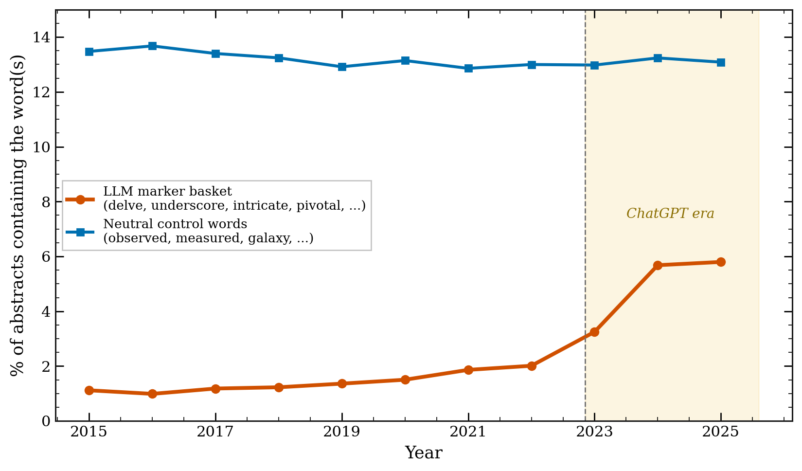
*Figure 1: The share of astro-ph abstracts containing a chatbot marker word (orange) sits
near 1.5% for years, then rises after ChatGPT to about 5.8% by 2025. The neutral control
words (blue) stay flat over the same period. Both curves are per-abstract fractions, so the
figure ends at the last full year, 2025.*

The control line is the point of the figure. If both lines moved together, the rise would
just mean that abstracts changed for some general reason. Instead, the neutral words hold steady near 13% while the marker words go from about 1.5% to 5.8%. The change is specific
to the words that chatbots favor.

## The word that gave the game away, then went quiet

Here is where it gets more interesting. In the middle of 2024, *delve* became a running joke
online as the word that gives away chatbot text. Watch what happens next.

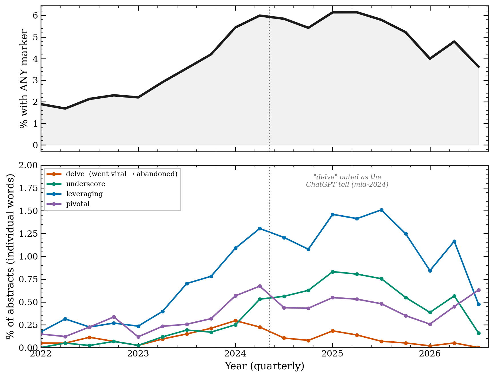
*Figure 2: Top: the share of abstracts with any marker word, by quarter, keeps climbing.
Bottom: individual words. "delve" (orange) peaks in early 2024 and then falls back toward
where it started, while less famous words like "underscore" and "leveraging" keep rising.*

Once *delve* was known, it went away. Authors, and the tools themselves, stopped using it.
But the top panel shows that the overall marker rate did not fall with it. Other words took over the load. Earlier work found the same pattern across all of arXiv, and astronomy follows
it closely.

## Letting the data pick the words

Importing a word list from computer science and biomedicine invites a fair question: what if
astronomy is different? So, I threw out the list and let the data choose. I took every word,
measured how much more common it became in 2024 to 2026 than in 2018 to 2021, and ranked the
biggest movers.

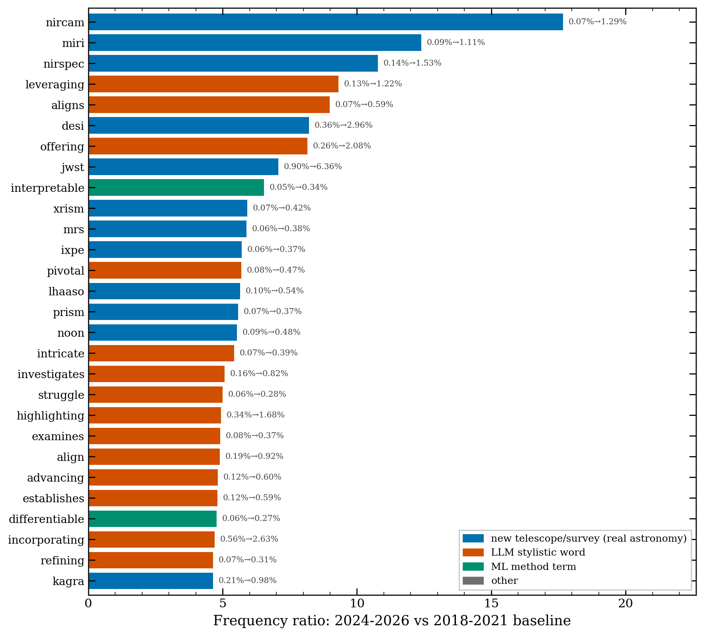
*Figure 3: The words whose frequency rose the most in astro-ph, ranked by ratio. They split
into two groups. Blue words are new telescopes and surveys (JWST's NIRCam, MIRI, NIRSpec,
the DESI survey), real astronomy events. Red words are chatbot-style verbs and adjectives
(leveraging, pivotal, intricate, highlighting).*

The list sorts itself into two families. One family is names of instruments and surveys that
came online in these years, which is exactly what you would want a working method to catch.
The other family is the same style words that showed up in computer science and biomedicine,
now found in astronomy on their own terms, sitting right next to the new telescopes. The
imported word list was not needed. Astronomy's own text points at the same words.

## Putting a number on it

So, what is the fraction for astronomy? I used a conservative approach: count the share of
2024 to 2026 abstracts that contain at least one marker word and subtract the pre-2022 baseline. That difference is a floor, not the true value, because a chatbot-edited abstract
need not contain any word from a short list, and because I subtract off the human baseline.

That floor is about 4.3% of 2025 abstracts. The real figure is higher, since the method only
catches abstracts that happen to keep one of the listed words.

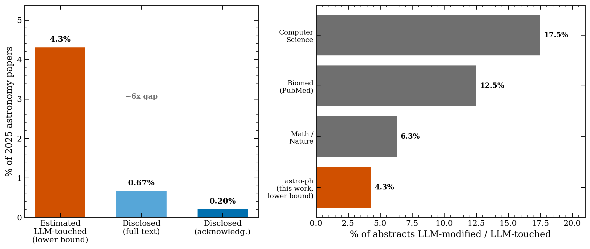
*Figure 5: Left, the gap in 2025 astronomy between the estimated share of abstracts touched
by a chatbot (about 4.3%, a lower bound) and the share that say so. Right, how the astronomy
floor sits against published figures for other fields.*

Where does astronomy land? Below computer science and biomedicine, above nothing that has
been measured, and in the same range as physics and mathematics. Given that this is a floor,
astronomy is likely in the same neighborhood as the rest of science: a few percent to low
double digits of abstracts with some chatbot help.

## Using it and saying so are not the same

If a few percent of abstracts have chatbot help, how many authors mention it? NASA ADS lets
you search the acknowledgments section of papers, which is where people note the tools they
used. I searched astronomy papers each year for clear terms: ChatGPT, GPT-4, "large language
model", GitHub Copilot. I left out words like "Gemini", which in astronomy usually means the
Gemini Observatory, and "Claude", which is often a person's name.

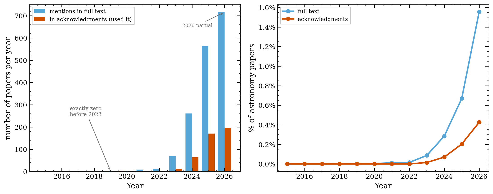
*Figure 4: Left, the count of astronomy papers each year that mention a chatbot in the text
(blue) or in the acknowledgments (orange). The count is exactly zero before 2023, then goes
up. Right, the same as a share of all astronomy papers, which stays under 1%.*

The count starts at zero before 2023, which is a good sign that the search is clean. It then
goes up every year. But as a share of all astronomy papers it is still under 1%. In 2025,
about 0.20% of papers noted a chatbot in the acknowledgments, and about 0.67% mentioned one
anywhere in the text. Set that against the 4.3% floor from the word counting. Use is common.
Saying so is rare.

## The ladder of ways to catch it

I tried one more thing. arXiv posts the LaTeX source of most papers, not just the final PDF.
Sometimes a chatbot's boilerplate gets pasted into that source and left in a comment that
never shows up in the PDF, lines like "as an AI language model". I downloaded the source of
3,950 papers and searched for these leftovers.

I found almost none. Across the recent papers, the rate of clear leftovers is about 0.13%.
Two of the handful of hits were papers that study chatbots as a research topic, not writing
slips. One was a real leftover, a comment noting that ChatGPT had been used to format author
affiliations. That is it.

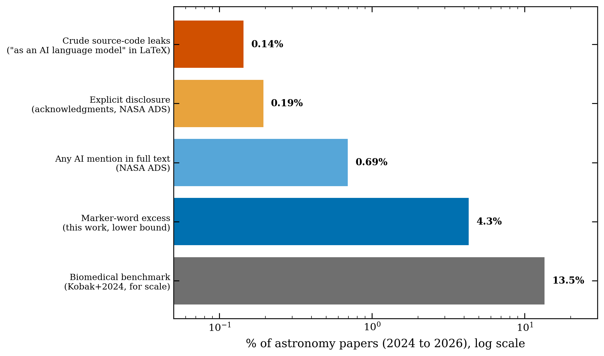
*Figure 9: Five ways to look for chatbots in the same 2024 to 2026 astronomy papers, on a
log scale. Source-code leftovers (0.13%) and stated disclosure (0.19%) find the least. Word
statistics (4.3%, a lower bound) find much more. The biomedical figure is shown for scale.*

Put these methods side by side and they cover two orders of magnitude. The blunt checks, the
ones that look for a clear slip or a clear statement, find almost nothing. The word counting
finds far more. If you only trusted the blunt checks, you would conclude that astronomy has
no chatbots in it, and you would be wrong. This is the case for counting words: it is the
only method here that sees the bulk of the use.

## One place astronomy holds up well

There is a real worry in other fields that chatbots invent references, citations to papers
that do not exist. A recent audit of medical papers found the rate of made-up citations
rising, reaching roughly one paper in 458 by 2025. Astronomy has a tool that should guard
against this: the NASA Astrophysics Data System, which nearly every astronomer uses to build
their reference lists, so the identifiers are real by construction.

I checked. From the source of recent papers, I pulled about 6,460 cited arXiv identifiers and
2,500 cited DOIs (a DOI is a permanent code that points to a specific paper or dataset). Then
I looked up whether each one exists.

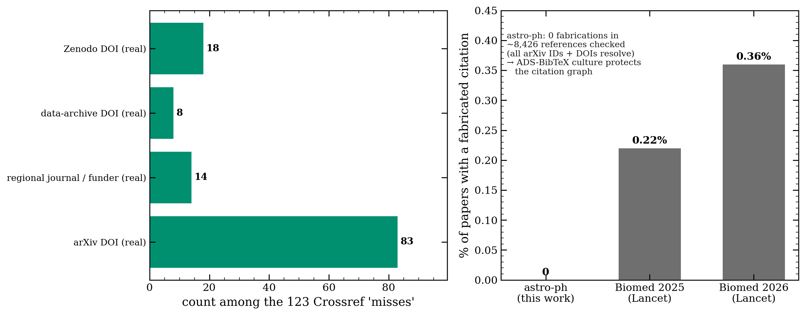
*Figure 12: Left, the 123 DOIs that a first check flagged as "not found" are all real once
you account for where they are registered (arXiv's own system, Zenodo, data archives, and
regional journals), not fakes. Right, the fabricated-citation rate for astronomy against
recent figures for biomedicine.*

Every one of the 6,460 arXiv identifiers exists. Of the DOIs, the ones a first pass could
not find turned out to be real records held in registries that the checking service does not
index, such as arXiv's own system and the Zenodo archive. After sorting those out, the count
of invented citations is zero. Astronomy's habit of building reference lists from ADS seems
to protect it from a problem that is growing elsewhere.

## Where the signal is heading

Look back at Figure 2 and you will notice the marker rate dips a little in 2026. It would be
easy to read that as chatbot use going down. It is not. Here is the same period next to the
disclosure count.

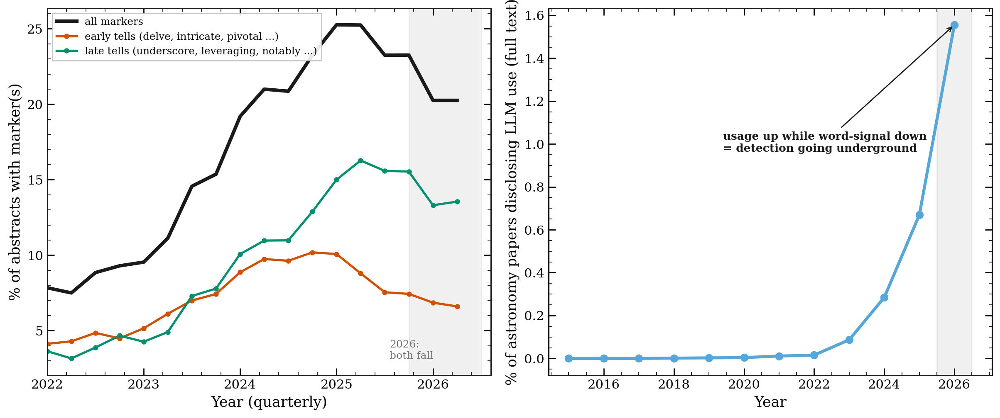
*Figure 8: Left, the marker words soften across the board in 2026. Right, over the same
months, the number of papers that state chatbot use keeps going up, in half a year already
past the full 2025 count. Stated use rises while the word signal falls.*

If use were falling, the disclosure count would fall too. Instead, it rises. What is fading is
the word signal, not the use. Newer chatbots write with fewer of the old tells, and authors
have learned to edit the famous words out. The counting method that works today will work
less well next year. That is worth stating plainly for anyone who reads a marker-word study:
the number it gives is a floor, and the floor is sinking even as use grows.

## Louder, but no more careful

Word counting can show something beyond a yes or no. I looked at two other groups of words:
promotional words like *unprecedented* and *remarkable*, and hedging words like *may*,
*might*, and *suggest* that mark caution.

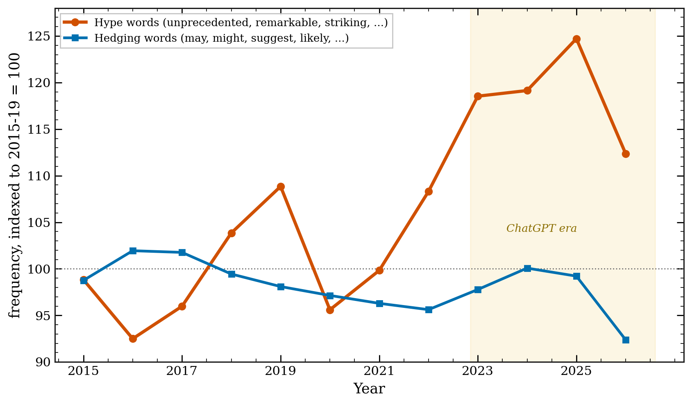
*Figure 7: Promotional words per 1,000 words (orange) rose about 19% as chatbot use grew,
and track the marker rate closely. Hedging words (blue) stayed flat.*

The promotional words went up by about 19% and rose in step with the chatbot markers. The
hedging words did not move. Astronomy abstracts got louder without getting more careful. I want to be careful here: this is a correlation, and competition for attention pushes
promotion up on its own. But the fact that caution held flat while volume rose is worth
noting.

## Who, and where

Two last cuts of the data. First, by subfield.

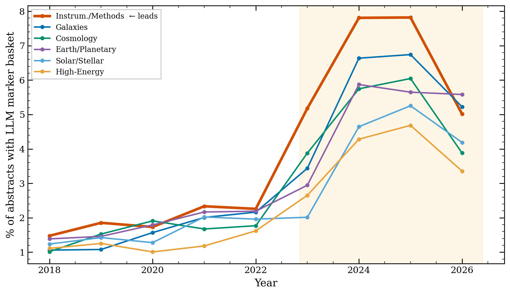
*Figure 10: The marker rate by astro-ph subfield. Instrumentation and Methods, the subfield
closest to software and machine learning, is highest throughout. High-energy astrophysics is
lowest.*

The subfield nearest to computer science, Instrumentation and Methods, adopted the style
first and holds the highest rate. The same "computer science goes first" pattern seen across
science shows up inside astronomy too.

Second, by country. Using ADS affiliations, I measured the marker rate and the disclosure
rate for papers from different countries.

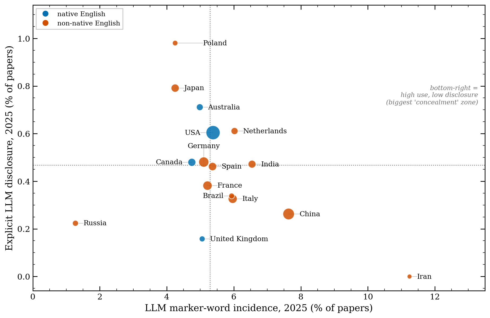
*Figure 11: Marker rate (x-axis) against disclosure rate (y-axis) by country in 2025. Blue
points are countries where English is a first language. Papers from Iran, China, and India
sit toward the right, with higher marker rates.*

Papers from countries where English is not the first language tend toward higher marker
rates, with Iran, China, and India on the right side of the plot. This fits a reading of
chatbots as a writing aid for non-native English speakers, which is a use worth keeping in
mind before anyone treats a marker word as a mark against a paper. It is not a clean split,
though: papers from Japan and Russia sit lower. One pattern does stand out. Papers from China
have a high marker rate and one of the lowest disclosure rates, the widest gap between using
and saying on the plot.

## What this does and does not mean

A few things to hold onto. A marker word is a sign of chatbot-edited language, not of faked
science. An abstract with *delve* in it is not fraud. For many authors, and especially for
those writing in a second language, a chatbot is an editor that lowers a real barrier, and
framing that as contamination would be unfair. The word method also has a shelf life, as
Figure 8 shows, and it reads abstracts, not full papers. And there is a difference between
three things that are easy to blur together: a chatbot used as a copy editor, a chatbot used
to draft content, and a paper generated wholesale. The word counting mostly sees the first.

On policy, the picture is uneven. arXiv asks authors to note significant use of generative
tools and does not allow a tool to be listed as an author. Observatory time-allocation rules,
such as those at ESO, forbid using a chatbot to judge a proposal. Astronomy and Astrophysics
put out a statement on AI-assisted writing in mid-2026. A clear, dated policy from the AAS
journals is harder to find written down in one place. The open question is whether astronomy
should agree on a disclosure norm now, before any single case forces the issue.

## A note on how this was written

Given the subject, it is only fair to say how this post was made. I used Claude Code to gather
the data, write the counting code, and draft the figures. I checked the numbers against the
public arXiv and ADS records. The code and the derived data are on GitHub at
[github.com/seratsaad/llm-in-astro-ph](https://github.com/seratsaad/llm-in-astro-ph), with
instructions so anyone can repeat the counts or rebuild the figures. Some of the tools this
work builds on, including the astro-ph knowledge graph, are shared by Yuan-Sen Ting at
[github.com/tingyuansen](https://github.com/tingyuansen). The words here are my own. It is
harder than it sounds, which is part of the point.

So, back to the number. A few percent of recent astronomy abstracts, at least, carry the
mark of a chatbot, and fewer than one in a hundred papers say so. The gap is the story. Would
you disclose it, if you used one? Would you want to know if a referee used one on your paper?
Astronomy has a short window to answer those questions on its own terms, before the words
stop giving anyone away.
